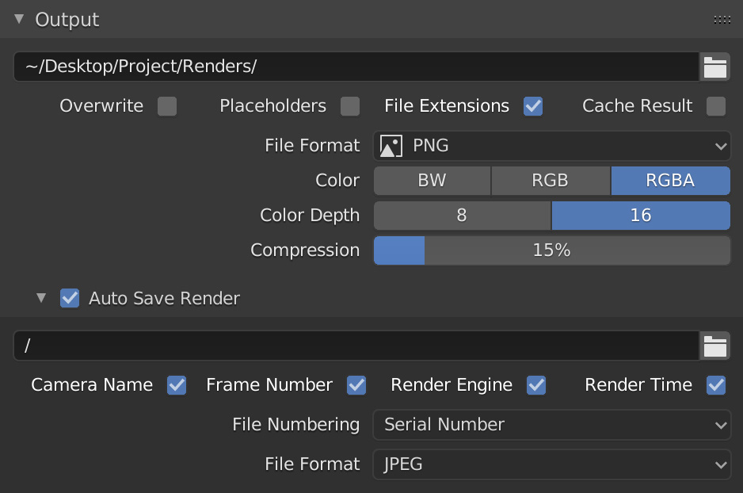
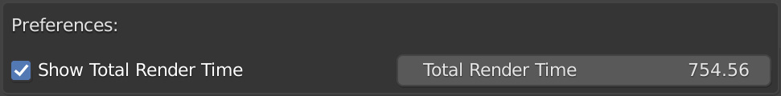
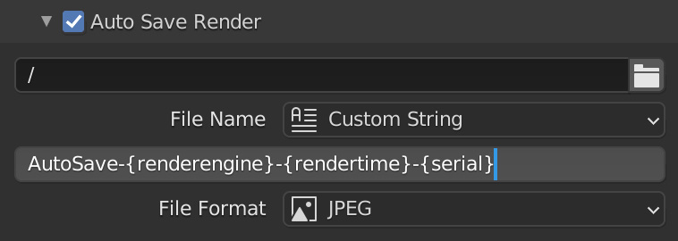

# VF-BlenderAutoSaveRender
Automatically saves a numbered or dated image after every render. This Blender Add-on is designed to make test renders easier to review, saving what would otherwise be lost when quitting the app. It's also good for creating a progression timelapse after a project is complete, or naming rendered files with the currently selected object or other custom settings.

## Installation and usage
- Download the .py file
- Open Blender preferences and navigate to the "Add-ons" tab
- Install and turn on the Add-on
- It will be enabled by default in the Render Output panel, where you can customise the automatic file output settings

## Add-on Preferences

Add-on preferences are found in the plugin listing in the Add-on panel of the user preferences.

- `Show Total Render Time` toggles the "total time spent rendering" display in the project settings (turned off by default)
- `Total Render Time` shows the raw value in seconds in case you need to manually override the project-specific value

## Project Settings

Project settings are found at the bottom of the Render Output panel and are unique per-project. The Add-on can be disabled here by unchecking `Auto Save Render` (turned on by default).

### Autosave Location

- Leave a single forward slash `/` to automatically generate a folder with the same name and in the same directory as the Blender project
- Or select a specific directory such as `/project/renders/autosave/` to automatically save all renders to the same location

### File Name

- `Project Name + Serial Number`
  - This uses the name of the Blender file and a generated serial number (it will detect any existing files in the autosave location and increment by one)
- `Project Name + Date & Time`
  - This uses the name of the blender file and the local date and time (formatted YYYY-MM-DD HH-MM-SS using 24 hour time)
- `Project Name + Render Engine + Render Time`
  - This uses the name of the blender file, the name of the render engine, and the time it took to render
  - If a sequence is rendered, only the final frame will be saved and this value will be the total sequence render time, not the per-frame render time
- `Custom String`
  - This uses pattern replacement to allow for entirely unique file naming patterns
  - Supported variables:
    - `{project}` = the name of the Blender file
    - `{item}` = active item (if no item is selected or active, this will return "None")
    - `{camera}` = render camera (independent of selection or active status)
    - `{frame}` = current frame padded to four digits
    - `{renderengine}` = internal name of the current rendering engine
    - `{rendertime}` = time spent rendering (this is calculated within the script and may not exactly match the render metadata since it's not included in the Python API)
    - `{date}` = current date in YYYY-MM-DD format
    - `{time}` = current time in HH-MM-SS format (using a 24 hour clock)
    - `{serial}` = automatically incremented serial number padded to 4 digits
- `Serial Number`
  - This input field only appears if the text `{serial}` appears in the `Custom String` setting, and automatically increments every time a render is saved while still allowing for user override if needed

_Warning_: using a custom string may result in overwriting files or failing to save if the generated name is not unique (for example, if date and time or serial number variables are not included).

### File Format

- `Project Setting` will use the same format as set in the Render Output panel
- `PNG`
- `JPEG`
- `OpenEXR MultiLayer`

### Total Time Spent Rendering

- This simply displays the total number of hours, minutes, and seconds spent rendering the current project, and must be enabled in the Add-on Preferences (see above)

## Notes

- Auto Save Render depends on the Blender file having been saved at least once, otherwise there is no project name or directory for the Add-on to work with
- Auto Save Render will only save the final frame when rendering sequences, preventing mass dupliation, but still allowing for total render time to be saved