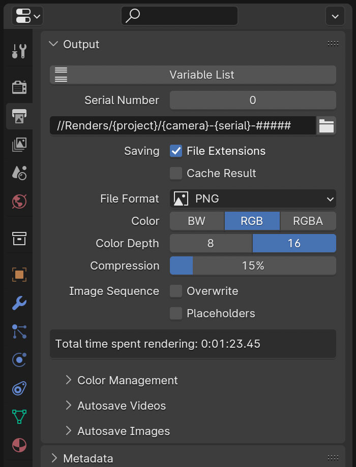
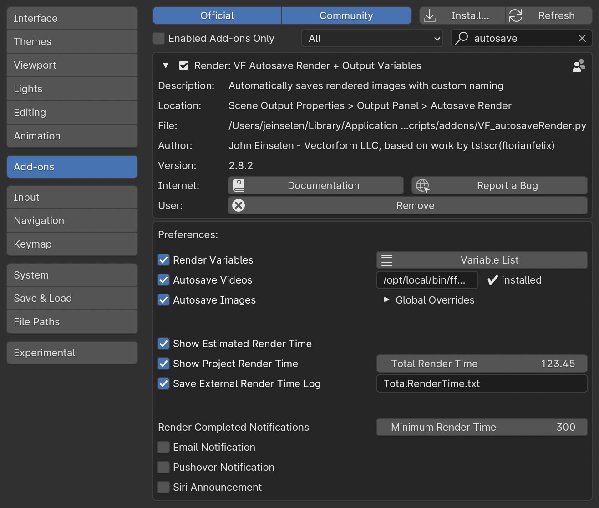
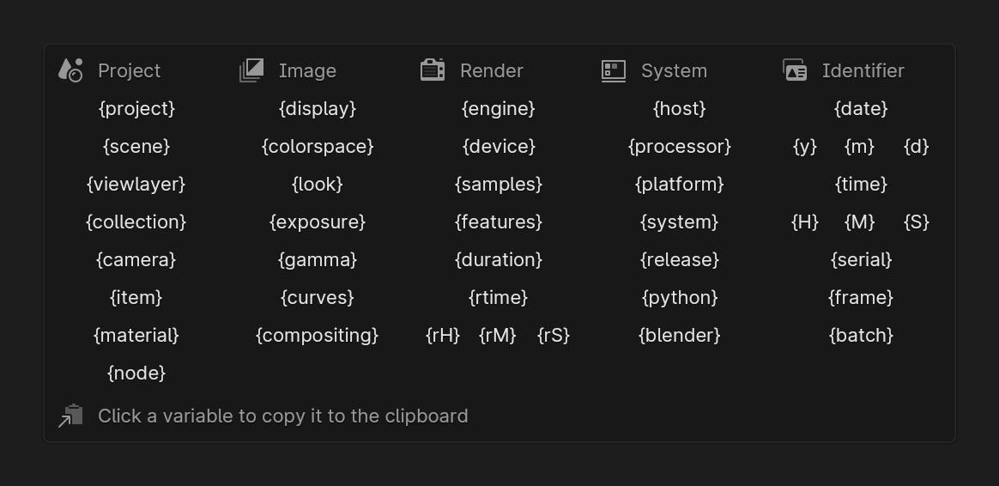
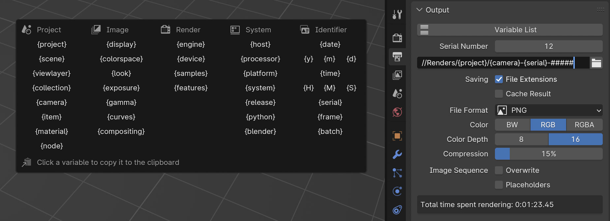
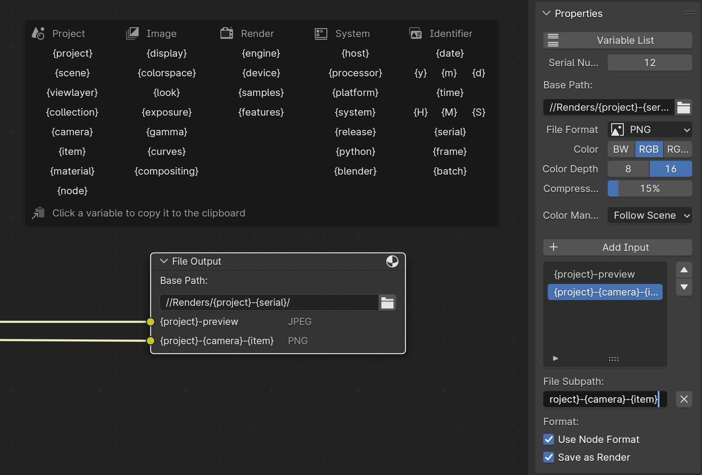
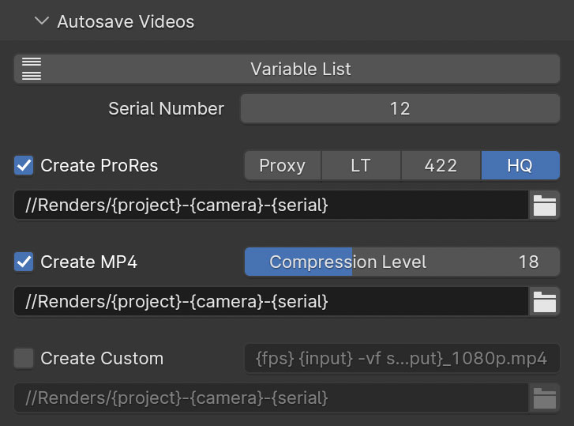
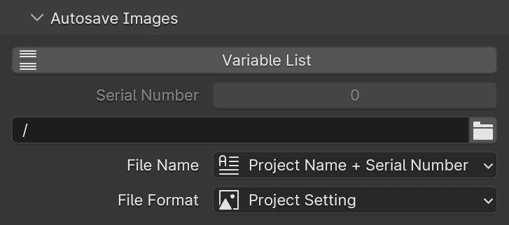
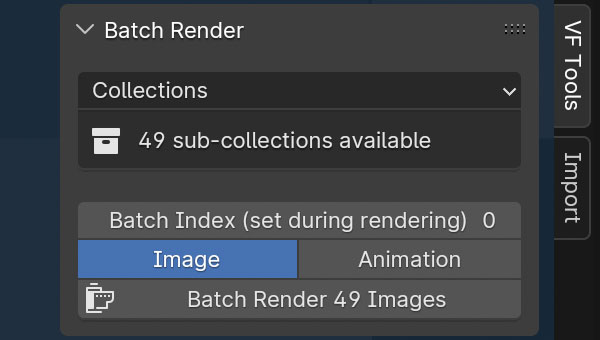
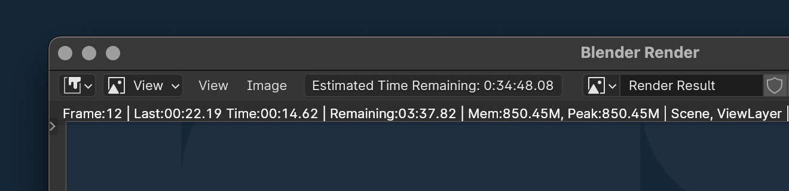
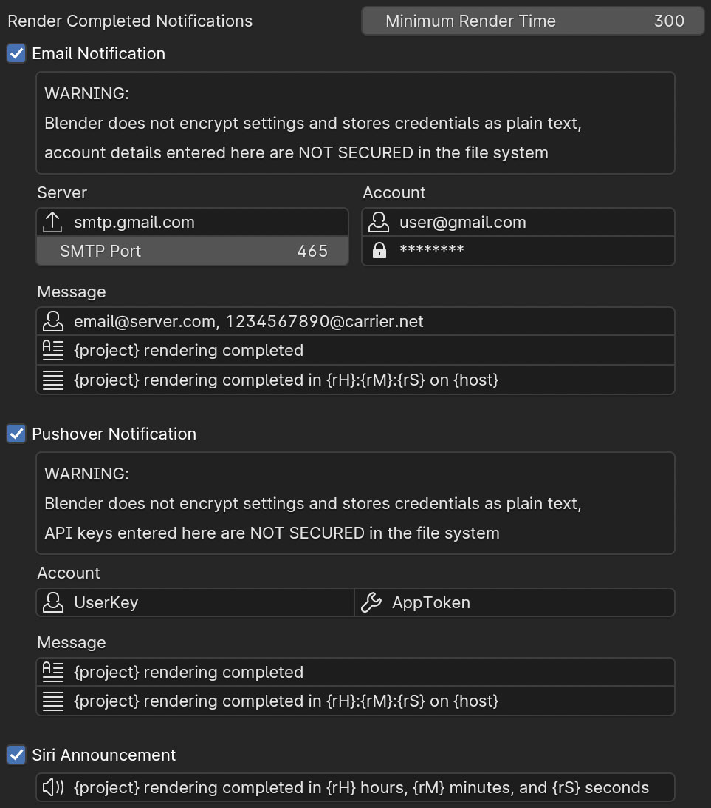

# VF Autosave Render + Output Variables

Automates file naming with dynamic variables in the standard output path and compositing file output nodes, and	enables more advanced production workflows with various kinds of batch rendering, automatic compiling of image sequences into videos using FFmpeg, and saving a numbered, dated, or custom formatted image after every render. Render time estimation and logging is also tracked.

----------

### Documentation Sections:

- Introduction
	- [Installation and Usage](https://github.com/jeinselen/VF-BlenderAutosaveRender#installation-and-usage)
	- [Global Preferences](https://github.com/jeinselen/VF-BlenderAutosaveRender#global-preferences)
- Variables
	- [Variables List](https://github.com/jeinselen/VF-BlenderAutosaveRender#variables-list)
	- [Render Output](https://github.com/jeinselen/VF-BlenderAutosaveRender#render-output)
	- [File Output Nodes](https://github.com/jeinselen/VF-BlenderAutosaveRender#file-output-nodes)
- Autosaving
	- [Autosave Videos](https://github.com/jeinselen/VF-BlenderAutosaveRender#autosave-videos)
	- [Autosave Images](https://github.com/jeinselen/VF-BlenderAutosaveRender#autosave-images)
- Batches
	- [Batch Render](https://github.com/jeinselen/VF-BlenderAutosaveRender#batch-render)
- Extras
	- [Estimated Time Remaining](https://github.com/jeinselen/VF-BlenderAutosaveRender#estimated-time-remaining)
	- [Render Complete Notifications](https://github.com/jeinselen/VF-BlenderAutosaveRender#render-complete-notifications)
	- [Notes](https://github.com/jeinselen/VF-BlenderAutosaveRender#notes)

----------

## Installation and Usage

- Download [VF_autosaveRender.py](https://raw.githubusercontent.com/jeinselenVF/VF-BlenderAutoSaveRender/main/VF_autosaveRender.py)
- Open Blender Preferences and navigate to the "Add-ons" tab
- Install and enable the add-on
- Basic autosaving and variable features will be turned on by default, with more options in the preferences

**Note for Viewport Rendering:** Blender does not trigger pre-render and post-render events when using `Viewport Render Image`, `Viewport Render Keyframes`, and `Viewport Render Animation`, which means this plugin is never informed that a render is happening. Unfortunately Blender uses the same output directory for both saving viewport images and actual rendering; output files will still be saved from the viewport, but the unresolved variable names will be used instead of the expected dynamic content. [Please see this issue report for more details and potential workarounds for playblast style rendering.](https://github.com/jeinselenVF/VF-BlenderAutosaveRender/issues/7)

The default settings will work as-is, saving each render in a folder alongside the project file with automatic serialisation and JPG compression. But significant customisation is possible, especially through the use of output path and file name variables.

## Global Preferences

Plugin settings are found in the Blender Preferences panel add-on tab. These settings apply globally to all projects opened on the local system, except for the `Total Render Time` value which is saved within individual project files.

- `Render Variables` enables dynamic variables in the Render tab > Output panel *output path* and File Output nodes in the Compositor workspace
	- Variables are supported in both the base path and all image inputs of File Output nodes (see the [File Output Nodes](https://github.com/jeinselen/VF-BlenderAutosaveRender#file-output-nodes) section below)

- `Autosave Videos` if FFmpeg is installed, enables the Render tab > Output panel > Autosave Videos interface, which has options for compiling completed image sequences to ProRes, MP4, and custom FFmpeg command line strings (see the [Autosave Videos](https://github.com/jeinselen/VF-BlenderAutosaveRender#autosave-videos) section for more details)
	- Installation location is autodetected, but can be set to a custom location if needed

- `Autosave Images` saves an image every time rendering is completed or canceled (saving current progress), using the custom settings in the Render tab > Output panel	(see the [Autosave Images](https://github.com/jeinselen/VF-BlenderAutosaveRender#autosave-images) section for more details)
	- `Global Overrides` allows for overriding the autosaved file `Location`, `Name`, and `Format`, ignoring per-project settings in the Render tab > Output panel > Autosave Images section
	- The global override settings are the same as the Render tab settings (documented below), and any settings that are overridden, though still editable, will be greyed out in the Autosave Images panel to indicate they're being globally replaced
	- Be warned that updating or disabling/re-enabling the plugin will erase global override settings, including resetting the serial number variable back to 0 (like all plugins, non-project preferences like these global settings are erased when a plugin is disabled or replaced)

- `Show Estimated Render Time` displays the estimated time till completion in the render window menu bar (see the [Estimated Time Remaining](https://github.com/jeinselen/VF-BlenderAutosaveRender#estimated-time-remaining) section for details)

- `Show Project Render Time` toggles the "total time spent rendering" display in the Render tab > Output panel below the output settings
	- `Total Render Time` allows manual adjustment or resetting of the current project's render time tracking (this is the only value in the plugin settings panel that is unique per project)
	- The total render time value in the project will not increment when rendering files from the command line unless the project is explicitly saved after rendering concludes (this does not apply to the externally saved log file)
- `Save External Render Time Log` enables tracking of render time outside of the Blender file, supporting tracking during command line rendering (where the internal project value is typically not saved) or tallying the render time for all Blender projects in the same directory
	- Sub-folders and relative paths can be used (not absolute paths)
	- Only the `{project}` dynamic variable is supported
	- The default string `{project}-TotalRenderTime.txt` will save a dynamically labeled file alongside the project (logging render time per-project since each log file would be named per-project)
	- Using `TotalRenderTime.txt` will allow all Blender files in the same directory to use the same log file (logs would be per-directory, not per-project)
	- Whereas `{project}/TotalRenderTime.txt` will save the log file inside the default autosave directory (this is specific to MacOS and Linux; backslash would be required in Windows)

- Notification systems require careful review of the security risks, please see the [Render Complete Notifications](https://github.com/jeinselen/VF-BlenderAutosaveRender#render-complete-notifications) section below for more details

---

## Variables List

Dynamic variables can be used in the `Base Path` and individual input `File Subpath` strings of `File Output` nodes in the Compositing workspace, in the Render tab > Output panel > `Output Path`, and in the `Autosave Videos` and `Autosave Images` sub-panels for dynamically generated output locations and/or file names. Details about each of these features is available below the variable definitions here.

The available variables are sorted into four groups: Project (values derived from the project itself), Rendering (render engine settings), System (the computer system), and Identifiers (values unique to the time or iteration of the render).

1. **Project variables**
- `{project}` = the name of the Blender file
- `{scene}` = current scene being rendered
	- The active scene will be used regardless of compositor setup or other settings
- `{viewlayer}` = current view layer being rendered
	- The active view layer will be used regardless of compositor setup or other settings
- `{collection}` = active collection
	- If no collection is selected or active, this will return the root "Scene Collection"
- `{camera}` = render camera (independent of selection or active status)
- `{item}` = active item (camera, light, mesh, curve, etcetera)
	- If no item is selected or active, this will return "None"
- `{material}` = active material of active object
	- If the selected object doesn't contain a selected material, this will return "None"
- `{node}` = the active node in the active material of the active object
	- If an object > material > node selection is not found, this will return "None"
	- The `{material}` and `{node}` variable are more prone to failure because they require both a selected object and an active material slot, and should only be used in scenarios where the active selection is known to be reliable (such as with the image folder batch rendering function)
2. **Image variables**
- `{display}` = display device format
- `{colorspace}` = the output colour space, also known as the interchange format
	- This is called "View Transform" in Blender; `{viewtransform}` can be used interchangeably
- `{look}` = the additional contrast transform applied
- `{exposure}` = current exposure value
- `{gamma}` = current gamma value
- `{curves}` = returns the status of the color management curves, either "Curves" or "None"
	- All of the above color management controls set in the `Render` panel can be overridden in the `Output` panel: the variables should correctly reflect either approach, but will not reflect per-input overrides in `Compositing` tab `File Output` nodes
- `{compositing}` = returns the status of the compositing node tree, either "Compositing" or "None"
3. **Rendering variables**
	- `{engine}` = name of the current rendering engine (uses the internal Blender identifier)
	- Replaces `{renderengine}` for better readability, but the old variable still works as expected
	- `{device}` = CPU or GPU device
		- Workbench and Eevee always use the GPU
		- Cycles can be set to either CPU or GPU, but multiple enabled devices will not be listed
		- Radeon ProRender can use both CPU and GPU simultaneously, and in the case of multiple GPUs, additional active devices will be added as "+GPU"
		- LuxCore can be set to either CPU or GPU, but multiple enabled devices will not be listed
	- `{samples}` = number of samples
		- Workbench will return the type of antialiasing enabled
		- Eevee will return the total number of samples, subsurface scattering samples, and volumetric samples
		- Cycles will return the adaptive sampling threshold, maximum samples, and minimum samples
		- Radeon ProRender will return the minimum samples, maximum samples, and the adaptive sampling threshold
		- LuxCore will return the sample settings for adaptive strength, warmup samples, and test step samples (Path) or eye depth and light depth (Bidir)
		- All outputs reflect the order displayed in the Blender interface
	- `{features}` = enabled features or ray recursions
		- Workbench will return the type of lighting used; STUDIO, MATCAP, or FLAT
		- Eevee will list abbreviations for any active effects (ambient occlusion, bloom, screen space reflections, and motion blur with the number of steps) or "None" if all of them are disabled
		- Cycles will return the maximum values set for total bounces, diffuse, glossy, transmission, volume, and transparent
		- Radeon ProRender will return the maximum values set for total ray depth, diffuse, glossy, refraction, glossy refraction, and shadow
		- LuxCore will return the halt settings, if enabled, for seconds, samples, and/or noise threshold with warmup samples and test step samples
	- `{duration}` = time spent rendering in seconds
	- Replaces `{rendertime}` for better clarity and readability, but the old variable still works as expected
	- `{rtime}` = time spent rendering in HH-MM-SS format (hours will not roll over into days)
	- This is a combined shortcut for the individual date variables below
	- `{rH}` = just the hours component from `{rtime}`
	- `{rM}` = just the minutes component from `{rtime}`
	- `{rS}` = just the seconds component from `{rtime}`
		- Render time variables are only available _after_ rendering completes, and cannot be used in general file outputs where the variables must be set _prior_ to rendering
			- Post-render plugin features that support render time variables include:
				- `Autosave Videos` and `Autosave Images` features in the Render tab > Output panel
				- Render complete notifications
			- Pre-render plugin features that do *<u>not</u>* support render time variables include:
				- `Output Path` in the Render tab > Output panel
				- `Image Output` nodes in the Compositing workspace
		- Rendering duration is calculated within the script at render start and end, and may not _exactly_ match the render metadata (which is unavailable in the Python API)
4. **System variables**
- `{host}` = name of the computer or host being used for rendering
- `{processor}` = processor type (example: "x86_64")
- `{platform}` = operating system of the computer being used for rendering (example: "macOS-14.2.1-x86_64-i386-64bit")
- `{system}` = operating system type (examples: "Linux" "macOS" or "Windows")
- `{release}` = operating system version number (Linux version number includes release status)
- `{python}` = Python version number
- `{blender}` = Blender version number and type (examples: "3.3.1-release" or "3.4.0-alpha")
	- Replaces `{version}` for improved clarity, but the old variable still works as expected
5. **Identifier variables**
- `{date}` = current date in YYYY-MM-DD format
	- This is a combined shortcut for the individual date variables below
- `{y}` or `{year}` = current year in YYYY format
- `{m}` or `{month}` = current month in MM format
- `{d}` or `{day}` = current day in DD format
- `{time}` = current time in HH-MM-SS 24-hour format
	- This is a combined shortcut for the individual time variables below
	- Note the uppercase capitalisation for the shorthand time variables, distinguishing them from the shorthand date variables (otherwise month and minute would conflict with each other)
- `{H}` or `{hour}` = current hour in HH 24-hour format
- `{M}` or `{minute}` = current minute in MM format
- `{S}` or `{second}` = current second in SS format
- `{serial}` = automatically incremented serial number padded to 4 digits
	- While this variable can be used in the autosave path and custom string, the output path, and in compositing tab file output nodes, the serial number for autosaving is separate so that test renders can use their own serial number tracking
	- The `Serial Number` input fields are enabled only when the `{serial}` variable appears in the associated path or file name, and will automatically increment every time a render is saved
	- The serial number will still increment even if the render output is not triggered during the rendering of a single image
	- Files may be overwritten if this counter is manually reset; both a feature and a danger
- `{frame}` = current frame number (padded to four digits)
	- This doesn't work well for the Output Path and Image Output nodes because those strings must be processed by the plugin before rendering starts, not during; the frame number would always be the same
	- Instead, use pound signs "####" for the Output Path and Image Output nodes

- `{batch}` = current index during batch rendering, or when not batch rendering, the index that can be manually set in the 3D View > VF Tools > Batch Render panel
	- The version of this addon from 2023 used `{index}`, which remains as an alias to the updated variable (older projects will still render as expected)

_**Warning:**_ using a custom string may result in overwriting or failing to save files if the generated name is not unique. For example, if date and time or serial number variables are not included.

## Render Output

When the `Render Variables` option is enabled in preferences, the native Blender `Output Path` is extended with all but the render time options; `{duration}` `{rtime}` `{rH}` `{rM}` and `{rS}` variables are not available because the data does not exist before rendering starts when these variables must be set. If the keyword `{serial}` is used anywhere in the output string, the `Serial Number` value will be enabled. Click the `Variable List` button to see a popup of all available keywords.

This works well for automatic naming of animations because the variables are processed at rendering start and will remain unchanged until the render is canceled or completed. Starting a new render will update the date, time, serial number, or any other variables that might have been changed.

However, note that when rendering still images (which Blender won't automatically save), and the output path includes a serial number, the serial number will still be incremented even though the still image wasn't rendered. This is because Blender doesn't differentiate between still and sequences renders when triggering rendering start; the plugin can't tell if the output will be saved or not by Blender when a render starts, and must assume that the output path needs to be prepped (attempting to work around this is difficult, and could easily introduce bugs where the serial number doesn't increment correctly, a situation that should definitely be avoided).

## File Output Nodes

When the `Render Variables` option is enabled in preferences, `File Output` nodes in the Compositing tab are extended with all but the total render time options; `{duration}` `{rtime}` `{rH}` `{rM}` and `{rS}` variables are not available because the data does not exist before rendering starts when these variables must be set. If the keyword `{serial}` is used anywhere in the output string, the `Serial Number` value will be enabled. Click the `Variable List` button to see a popup of all available keywords.

This feature supports customisation of both the `Base Path` and each image input `File Subpath` in the node. Like the render output variables feature, this fully supports animations, including the date and time variables which are set at render start (not per-frame).

---

## Autosave Videos

This feature is still in very early testing and is not ready for an official release yet. If you'd like to try it out, however, it's available by downloading the plugin [directly from the repository](https://raw.githubusercontent.com/jeinselenVF/VF-BlenderAutosaveRender/main/VF_autosaveRender.py) instead of the releases page. You will need to have a local [FFmpeg installation](https://ffmpeg.org/download.html) on your system to use this feature (the version bundled inside Blender doesn't seem to be accessible via the Python API).

If enabled in the plugin settings along with a valid FFmpeg path, options to automatically compile rendered image sequences into playable videos after rendering completes will appear in the rendering output panel labeled `Autosave Video`. Apple ProRes (Proxy, LT, 422, an HQ presets available), H.264 MP4 (with adjustable quality), and custom string (using variables for `{input}` `{fps}` and `{output}`) are all available, and can be enabled concurrently for multi-format outputs.

FFmpeg only supports some of the image formats that Blender does. The standard formats found in FFmpeg 4.4.x are used by default; bmp, png, jpg, dpx, exr (single layer only), and tif. If there's a mismatch in your particular Blender + FFmpeg setup, you can find the supported file list for your installation of FFmpeg by entering `ffmpeg -formats` in a command line terminal (look for sequence formats), and then modifying the `FFMPEG_FORMATS` list found near the top of the plugin code to correct any issues.

If you run into any issues, especially when using the custom option, try running Blender in terminal mode to check for error codes. If you have any questions about FFmpeg command line formatting, please check https://ffmpeg.org for documentation.

## Autosave Images

Project settings are found at the bottom of the Render Output panel and are unique per-project. Automatic saving of every render can be disabled by unchecking `Autosave Render`, which is turned on by default.

- `Variable List`
	- This opens a reference panel with all of the variables that can be used in either the `file location` or `custom string` strings below
	- Clicking on a variable will copy it to the clipboard, ready for pasting wherever it's needed in an output path or file name

- `Serial Number`
	- This is the local project serial number for autosaved files, independent of the serial number for output files, and will be unused if file location or file name inputs are replaced with a global override in the `Blender Preferences > Add-on` window, which uses the serial number saved in the plugin preferences
	- It will be greyed out if the variable `{serial}` does not appear in the `file location ` or `custom string` inputs

- `Autosave Location`
	- Leave a single forward slash `/` to automatically generate a folder with the same name and in the same directory as the Blender project
	- Or select a specific directory such as `/project/renders/autosave/` to automatically save all renders to the same location

- `File Name`
	- `Project Name + Serial Number` uses the name of the Blender file and an auto-generated serial number (it will detect any existing files in the autosave location and increment the highest number found)
	- `Project Name + Date & Time` uses the name of the blender file and the local date and time (formatted YYYY-MM-DD HH-MM-SS using 24 hour time)
	- `Project Name + Render Engine + Render Time` uses the name of the blender file, the name of the render engine, and the time it took to render
		- When a sequence is rendered, only the final frame will be saved and this value will be the total sequence render time, not the per-frame render time
	- `Custom String` uses the dynamic variables listed above to allow for entirely unique file naming patterns

- `File Format`
	- `Project Setting` will use the same format as set in the Render Output panel (see note below about multilayer EXR limitations)
		- If an EXR format is selected in the Output panel, only a single layer EXR will be autosaved from this sub-panel; the Blender Python API `image.save_image` has a known and long-standing bug that [prevents the saving of multilayer EXR files](https://developer.blender.org/T71087)
		- This issue does not impact any other rendering features
	- `PNG`
	- `JPEG`
	- `OpenEXR`

File formats will use whatever compression preferences have been set in the project file. If you want to render animations using the PNG format, but save previews using JPG with a specific compression level, temporarily choose JPG as the Blender output format and customise the settings, then switch back to PNG. When the add-on saves the render file, it'll use the (now invisible) JPG settings saved in the project file.

Only the final frame will be autosaved when rendering animation sequences, preventing mass duplication of frames but still allowing for total render time to be saved in the file name (if included with the `Custom String` setting and the `{duration}` or other render time variables)

---

## Batch Render

The `Batch Render` interface appears in the `VF Tools` tab of any 3D view, and allows the user to select from a number of batch options.

- `Batch Type` sets the batch rendering mode

	- `Cameras` renders the same scene for each selected camera or each camera in the selected collection
	- `Collections` renders the scene for each child collection within the selected collection
		- Little bit of trivia; this is how the BCON 2023 [Production Pipelines for Interactive Platforms](https://www.youtube.com/watch?v=Uu35wS8iDJ8) presentation slides were rendered
	- `Items` renders each selected item, or each item in the selected collection
	- `Images` renders each image in a source folder, replacing the source of a single target Image Texture node each time
		- `Source Folder` sets the input folder of images that should be used for batch rendering
		- `Assign Image Node` will assign the currently selected Object > Material > Image Texture node as the target (this must be assigned before batch rendering will be enabled in this mode)

	- If no valid selection, collection, or texture source is found, a warning will appear in the UI to indicate the issue

- `Batch Index` this can be manually entered for testing of procedural systems, but during batch rendering will be set to the index of the current element in the batch list

- `Batch Range`

	- `Image` will render the current frame once for each element in the batch list
	- `Animation` will render the entire scene frame range for each element in the batch list

Batch render relies on the Python API to trigger each render, so Blender will freeze during processing with no updates visible (except for files being saved). This is a limitation of the Blender Python API and the heavy reliance on static context to operate.

Each image or sequence rendered in a batch list is treated as a separate render trigger, so variables like `{time}` and `{serial}` will be updated for each item in the list. The `{batch}` variable will also return the Batch Index during rendering, but more importantly the `{camera}` `{collection}` `{item}` and `{node}` variables for their respective batch types all reflect the element that's being rendered.

---

## Estimated Time Remaining

When enabled in the preferences, time elapsed during animation renders will be tracked, and a rough estimate will be calculated for the remaining render time. This isn't particularly accurate, especially during the first few frames or in scenes with a great deal of variability from frame to frame, but can give a general idea of how much render time might remain.

The estimation will only show up after the first frame of an animation sequence is completed, and will not be displayed during single frame renders.

## Render Complete Notifications

Notifications all support the full list of render variables, so feel free to customise however you need. However, there are security issues with how Blender saves preferences; they're always plain text. Please read the warnings detailed below and proceed at your own risk.

- `Minimum Render Time` sets the threshold before notifications will be sent when a render is completed, measured in seconds (the default setting of 300 seconds = 5 minutes)
	- This is intended to prevent constant notifications of super short renders, but setting it to 0 will result in all notifications being sent

- `Email Notification` sends an email to any number of addresses on render completion, including texting mobile phones using email-to-text (depending on carrier support)
	- Blender does not encrypt plugin settings when saved to disk; the login password is stored as plain text so use this feature entirely at your own very, very terrible risk*
	- Even worse, the Python setup being used here doesn't work with accounts that use OAuth, two-factor authentication, or other security methods, so it really is about the most insecure setup possible
	- Manually encrypting secure content has been considered, but still requires saving the encryption key locally for reference; giving the *illusion* of better security (obscurity does help a little) without actually making it secure (they key would still be saved as plain text just like every other Blender preference)...if anyone has experience supporting OAuth or similar security setups within the Blender ecosystem, let me know!
- `Pushover Notification` sends a push notification to browsers and mobile devices on render completion
	- [Pushover](https://pushover.net) is a paid third-party service that supports browser notifications, iOS, and Android mobile devices (affordable one-time purchase for individuals, or a subscription for teams)
	- Once an account is created, you will need to set up a specific application key so Blender can access the API. It's super simple, and gives you up to 10k push notifications a month per app code without any additional costs.
	- Blender does not encrypt plugin settings when saved to disk; the user key and app token are stored as plain text so use this feature *entirely at your own risk*

- `Siri Announcement` is only available in MacOS; this announces render completion using the local Siri settings
	- `Siri Message` customises the spoken message, all dynamic variables are supported
	- The command blocks further processing till the message is completed, so long strings aren't ideal (you have to wait till they finish to continue using Blender)

### Details Regarding Email Notifications

Email setup requires an SMTP server with login credentials. Please note that while the Blender field is "protected" as a password (it only displays asterisks), it still allows for direct copying of the original password and stores it as plain text within the Blender user preferences file. <u>It's not actually protected at all and is *dangerously insecure*</u>. If you choose to use this feature (*never* with your primary email account), you do so entirely at your own risk.

The default email settings are for a generic Gmail account, which requires a dedicated application code that is only available when two factor authentication is turned on. This is not recommended from a security standpoint (that unsecured password in Blender gives full access to the gmail account), and again, should only be used with a burner email account and is entirely at your own risk.

If you would like to be notified via text message to a mobile phone number, please use email notifications sent to your carrier of choice, you can find the correct address for your phone number here: [Free Carrier Lookup](https://freecarrierlookup.com).

## Notes

- Autosaving a render, compiling sequences into videos, and other features depend on the Blender project file having been saved at least once in order to export images, otherwise there is no project name or local directory for the add-on to work with
	- An alternative version of the plugin that supports unsaved projects is [available in this older branch](https://github.com/jeinselenVF/VF-BlenderAutosaveRender/tree/Support_Unsaved_Projects)
- This add-on is provided as-is with no warranty or guarantee regarding suitability, security, safety, or otherwise. Use at your own risk.
