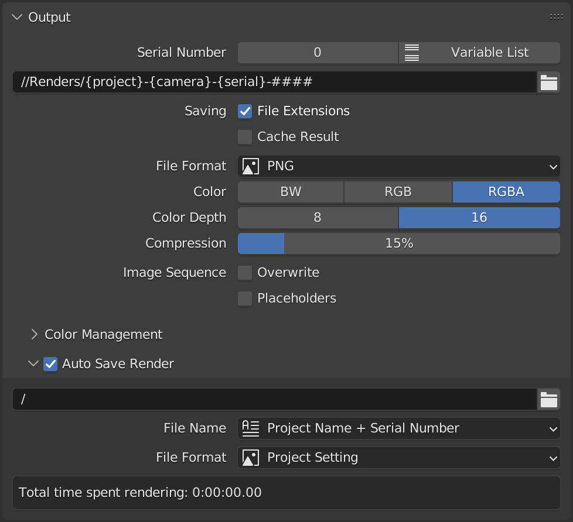
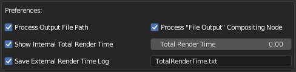
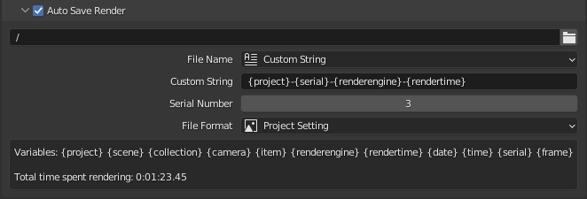
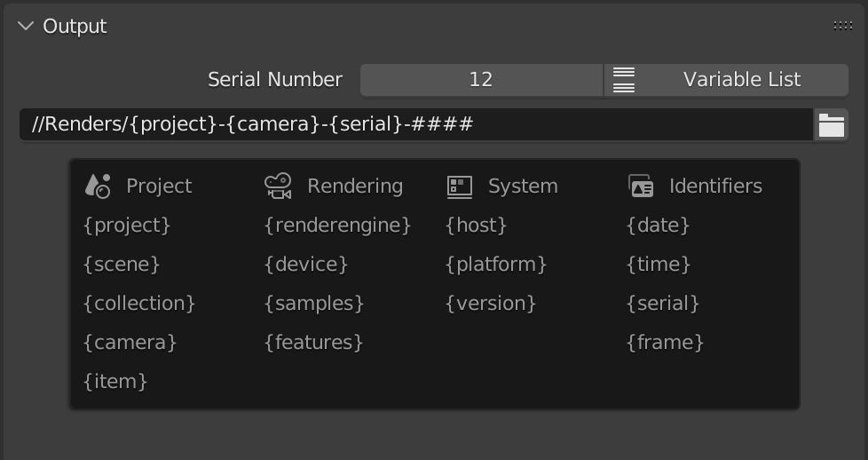
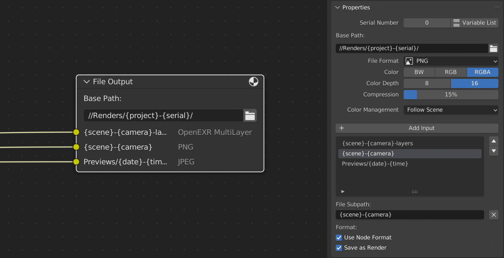

# VF Auto Save Render

Automatically saves a numbered or dated image after every render and extends the Blender output path and compositing output node with dynamic variables. This Blender Add-on helps automate file naming (enabling easier and more advanced production workflows) and makes test renders easier to review and compare (saving what would otherwise be overwritten or lost when quitting the app).

## Installation and Usage
- Download [VF_autoSaveRender.py](https://raw.githubusercontent.com/jeinselenVF/VF-BlenderAutoSaveRender/main/VF_autoSaveRender.py)
- Open Blender Preferences and navigate to the "Add-ons" tab
- Install and enable the Add-on
- It will be enabled by default in the Render Output panel, where you can customise the automatic file output settings

## Add-on Preferences

Add-on preferences are found in the Blender Preferences panel Add-on tab, at the bottom of the plugin listing. These settings apply globally to all projects except for the total render time, which is saved independently within each project file.

- `Process Output File Path` enables dynamic variables in the output file path
- `Process "File Output" Compositing Node` enables dynamic variables for the path and all image outputs of a Compositing tab node named "File Output" (see documentation below for more on this limitation)
- `Show Internal Total Render Time` toggles the "total time spent rendering" display in the project settings
  - `Total Render Time` shows the raw value in seconds in case you need to manually override the project-specific value
- `Save External Render Time Log` enables tracking of render time outside of the Blender file, which better supports command line rendering or tallying the render time for all Blender projects in the same directory
  - Sub-folders and relative paths can be used, but absolute paths are not supported
  - Only the `{project}` dynamic variable is supported
  - The default string `{project}-TotalRenderTime.txt` will save a dynamically labeled file alongside the project (logging render time per-project since each log file would be named per-project)
    - Using `TotalRenderTime.txt` will allow all Blender files in the same directory to use the same log file (logs would be per-directory, not per-project)
    - Whereas `{project}/TotalRenderTime.txt` will save the log file inside the default auto save directory (this is specific to MacOS and Linux; backslash would be required in Windows)
- `Display Estimated Remaining Render time` will display in the render window menu bar an estimation for how much time is left during the rendering of animations
  - This isn't particularly accurate, especially during the first few frames or in scenes with a great deal of variability in render time from frame to frame, but can give a general guess as to how long you have left to wait

## Project Settings

Project settings are found at the bottom of the Render Output panel and are unique per-project. The Add-on can be disabled here by unchecking `Auto Save Render` (turned on by default).

### Autosave Location

- Leave a single forward slash `/` to automatically generate a folder with the same name and in the same directory as the Blender project
- Or select a specific directory such as `/project/renders/autosave/` to automatically save all renders to the same location

### File Name

- `Project Name + Serial Number`
  - This uses the name of the Blender file and a generated serial number (it will detect any existing files in the autosave location and increment by one)
- `Project Name + Date & Time`
  - This uses the name of the blender file and the local date and time (formatted YYYY-MM-DD HH-MM-SS using 24 hour time)
- `Project Name + Render Engine + Render Time`
  - This uses the name of the blender file, the name of the render engine, and the time it took to render
  - When a sequence is rendered, only the final frame will be saved and this value will be the total sequence render time, not the per-frame render time
- `Custom String`
  - This uses pattern replacement to allow for entirely unique file naming patterns
  - Project variables:
    - `{project}` = the name of the Blender file
    - `{scene}` = current scene being rendered (if multiple scenes are used in the compositing tab, only the currently selected scene name will be used)
    - `{collection}` = active collection (if no collection is selected or active, this will return the root "Scene Collection")
    - `{camera}` = render camera (independent of selection or active status)
    - `{item}` = active item (if no item is selected or active, this will return "None")
  - Rendering variables:
    - `{renderengine}` = name of the current rendering engine (uses the internal Blender identifier)
    - `{device}` = CPU or GPU device
      - Workbench and Eevee always use the GPU
      - Cycles can use either CPU or GPU
      - Radeon ProRender can use both CPU and GPU simultaneously (in the case of multiple GPUs, additional active devices will be added as "+GPU")
    - `{samples}` = number of samples
      - Workbench will return the type of antialiasing enabled
      - Eevee will return the total number of samples taken, subsurface scattering samples, and volumetric samples
      - Cycles will return the adaptive sampling threshold, maximum samples, and minimum samples (reflecting the order displayed in the Blender interface)
      - Radeon ProRender will return the minimum samples, maximum samples, and the adaptive sampling threshold (reflecting the order displayed in the Blender interface)
    - `{features}` = enabled features or ray recursions
      - Workbench will return the type of lighting used; STUDIO, MATCAP, or FLAT
      - Eevee will list abbreviations for ambient occlusion, bloom, screen space reflections, and motion blur if enabled
      - Cycles will return the maximum values set for total bounces, diffuse, glossy, transmission, volume, and transparent
      - Radeon ProRender will return the maximum values set for total ray depth, diffuse, glossy, refraction, glossy refraction, and shadow
    - `{rendertime}` = time spent rendering (this is calculated within the script and may not _exactly_ match the render metadata, which is unavailable in the Python API)
  - System variables:
    - `{host}` = name of the computer or host being used for rendering
    - `{version}` = Blender version and status (examples: "3.3.1-release" or "3.4.0-alpha")
  - Identifier variables:
    - `{date}` = current date in YYYY-MM-DD format
    - `{time}` = current time in HH-MM-SS format (using a 24 hour clock)
    - `{serial}` = automatically incremented serial number padded to 4 digits
    - `{frame}` = current frame number (padded to four digits)
- `Serial Number`
  - This input field is displayed only when the text `{serial}` appears in the `Custom String` setting, and automatically increments every time a render is saved (easily overwritten if you need to reset the count at any time)

_Warning_: using a custom string may result in overwriting files or failing to save if the generated name is not unique (for example, if date and time or serial number variables are not included). The creator of this plugin accepts no responsibility for data loss.

### File Format

- `Project Setting` will use the same format as set in the Render Output panel (see note below about multilayer limitations)
- `PNG`
- `JPEG`
- `OpenEXR`

File formats will use whatever compression preferences have been set in the project file. If you want to render animations using the PNG format, but save previews using JPG with a specific compression level, temporarily choose JPG as your Blender output format and customise the settings, then switch back to PNG. When the add-on saves the render file, it'll use the (now invisible) project file JPG settings.

### Total Time Spent Rendering

- This tracks the total number of hours, minutes, and seconds spent rendering the current project, and the output panel display can be turned on in the Add-on Preferences (see above)

## Render Output Variables

If enabled in the add-on preferences, this extends the native Blender output path with almost all of the `Custom String` variables listed above.

- `{project}` `{scene}` `{collection}` `{camera}` `{item}` `{renderengine}` `{host}` `{device}` `{samples}` `{features}` `{date}` `{time}` `{serial}` `{frame}`

This works well for automatic naming of animations, since the variables are processed at rendering start and will remain unchanged until the render is canceled or completed. Starting a new render will update the date, time, serial number, or any other variables that might have been changed.

Note that `{rendertime}` is not included because it is still undetermined when Blender output values are created.

## Compositing Node Variables

If enabled in the add-on preferences, this extends the native Blender output path with almost all of the `Custom String` variables listed above.

- `{project}` `{scene}` `{collection}` `{camera}` `{item}` `{renderengine}` `{host}` `{device}` `{samples}` `{features}` `{date}` `{time}` `{serial}` `{frame}`

This supports customisation of both the `Base Path` and each `File Subpath` (image name). There is a limitation however; only one `File Output` node is supported, and it must be named "File Output" (any additional output nodes will be ignored). If multiple output directories are needed, the workaround is to include the folder paths within the specific image output names, not the base path.

Like the render output variables feature, this fully works with animations, including the date and time variables which are locked at render start. And as expected, `{rendertime}` is not included because it is still undetermined when Blender output values are initialised.

## Notes

- Auto Save Render depends on the Blender project file having been saved at least once in order to export images, otherwise there is no project name or directory for the add-on to work with
- Only the final frame will be atuo saved when rendering sequences, preventing mass dupliation but still allowing for total render time to be saved in the file name (depending on settings)
- Total internal render time will continue to increment even when auto file saving is toggled off in the output panel
- Total internal render time will not increment when rendering files from the command line, since it depends on being saved within the project file (and rendering from the command line typically doesn't save the project file after rendering finishes)
- The Blender Python API `image.save_image` has a known bug that [prevents the saving of multilayer EXR files](https://developer.blender.org/T71087), saving only a single layer file instead (I'm not aware of any reasonable workarounds, just waiting for it to be fixed)
- This add-on is used in regular production work by the author, but is offered here as-is with no guarantees regarding suitability, security, safety, or otherwise