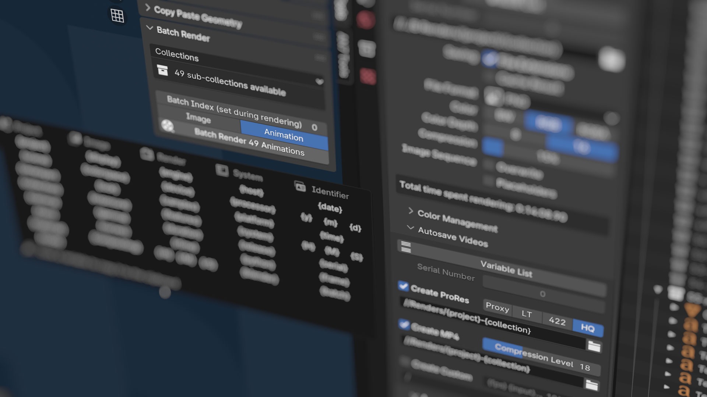

# VF Autosave Render + Output Variables

Automatically saves a numbered or dated image after every render and extends the Blender output path and compositing output node with dynamic variables for final renders. This Blender add-on helps automate file naming (enabling more advanced production workflows) and makes look development renders easier to review and compare (saving what would otherwise be overwritten or lost when quitting the app).

## Installation and Usage

- Download [VF_autosaveRender.py](https://raw.githubusercontent.com/jeinselenVF/VF-BlenderAutoSaveRender/main/VF_autosaveRender.py)
- Open Blender Preferences and navigate to the "Add-ons" tab
- Install and enable the add-on
- It will be enabled by default in the Render Output panel, where you can customise the automatic file output settings

_**Warning:**_ Blender does not trigger pre-render and post-render events when using `Viewport Render Image`, `Viewport Render Keyframes`, and `Viewport Render Animation`, which means this plugin is never informed that a render is happening. Unfortunately Blender uses the same output directory for both saving viewport images and actual rendering; output files will still be saved from the viewport, but the unresolved variable names will be used instead of the expected dynamic content. [Please see this issue report for more details and potential workarounds for playblast style rendering.](https://github.com/jeinselenVF/VF-BlenderAutosaveRender/issues/7)

The default settings will work as-is, saving each render in a folder alongside the project file with automatic serialisation and JPG compression. But significant customisation is possible, especially through the use of output path and file name variables.

## Global Preferences

Add-on preferences are found in the Blender Preferences panel add-on tab, at the bottom of the plugin listing. These settings apply globally, except for the `Total Render Time` value which is saved within the project file.

### Preferences
- `Render Output Variables` enables dynamic variables in the output file path
- `File Output Node Variables ` enables dynamic variables for the base path and all image inputs of `File Output` nodes in the Compositing tab (see the [Compositing Node Variables](https://github.com/jeinselenVF/VF-BlenderAutosaveRender#compositing-node-variables) section below)

### Render Time
- `Show Project Render Time` toggles the "total time spent rendering" display in the Blender Output panel
	- `Total Render Time` allows manual adjustment or resetting of the current project's render time tracking (this is the only non-global per-project value in the plugin settings panel)
- `Save External Render Time Log` enables tracking of render time outside of the Blender file, supporting tracking during command line rendering (where the internal project value is typically not saved) or tallying the render time for all Blender projects in the same directory
	- Sub-folders and relative paths can be used (not absolute paths)
	- Only the `{project}` dynamic variable is supported
	- The default string `{project}-TotalRenderTime.txt` will save a dynamically labeled file alongside the project (logging render time per-project since each log file would be named per-project)
	- Using `TotalRenderTime.txt` will allow all Blender files in the same directory to use the same log file (logs would be per-directory, not per-project)
	- Whereas `{project}/TotalRenderTime.txt` will save the log file inside the default autosave directory (this is specific to MacOS and Linux; backslash would be required in Windows)
- `Estimate Remaining Render Time` turns on animation render time estimation in the render window menu bar (see the [Estimated Time Remaining](https://github.com/jeinselenVF/VF-BlenderAutosaveRender#estimated-time-remaining) section below for details)

### Global Autosave Overrides
- This section allows for overriding autosave settings globally, making it easier to set up a single location for all autosaved renders, along with consistent name formatting and file types, especially for files created prior to setting up the Autosave Render plugin
- The global override settings are the same as detailed below, and any elements that are overridden will be greyed out (though still editable) in the project's Autosave Render panel
- Replacing or even just disabling the plugin will erase global override settings, including resetting the serial number variable back to 0. If this is being used to prevent file overwriting in a global override location, it's imperative to manually update the serial with the correct number after every time the plugin is disabled/enabled or uninstalled/installed.

## Dynamic Variables

Dynamic variables can be used in Blender's Output Path, in the Base Path and File Subpath strings of File Output nodes in the Compositing tab, and in the Custom String setting of the Autosave Render sub-panel.

The available variables are sorted into four groups: Project (values derived from the project itself), Rendering (render engine settings), System (the computer system), and Identifiers (values unique to the time or iteration of the render).

1. **Project variables**
	- `{project}` = the name of the Blender file
	- `{scene}` = current scene being rendered (the current active scene will be used regardless of compositor setup or other settings)
	- `{viewlayer}` = current view layer being rendered (the current active view layer will be used regardless of compositor setup or other settings)
	- `{collection}` = active collection (if no collection is selected or active, this will return the root "Scene Collection")
	- `{camera}` = render camera (independent of selection or active status)
	- `{item}` = active item (if no item is selected or active, this will return "None")
	- `{material}` = active material of active object (if not found, this will return "None")
	- `{node}` = the active node in the active material of the active object (if not found, this will return "None")
		- The `{material}` and `{node}` variable are more prone to failure because they require both a selected object and an active material slot, and should only be used in scenarios where the active selection is well managed
2. **Rendering variables**
	- `{renderengine}` = name of the current rendering engine (uses the internal Blender identifier)
	- `{device}` = CPU or GPU device
		- Workbench and Eevee always use the GPU
		- Cycles can be set to either CPU or GPU, but multiple enabled devices will not be listed
		- Radeon ProRender can use both CPU and GPU simultaneously, and in the case of multiple GPUs, additional active devices will be added as "+GPU"
		- LuxCore can be set to either CPU or GPU, but multiple enabled devices will not be listed
	- `{samples}` = number of samples
		- Workbench will return the type of antialiasing enabled
		- Eevee will return the total number of samples, subsurface scattering samples, and volumetric samples
		- Cycles will return the adaptive sampling threshold, maximum samples, and minimum samples
		- Radeon ProRender will return the minimum samples, maximum samples, and the adaptive sampling threshold
		- LuxCore will return the sample settings for adaptive strength, warmup samples, and test step samples (Path) or eye depth and light depth (Bidir)
		- All outputs reflect the order displayed in the Blender interface
	- `{features}` = enabled features or ray recursions
		- Workbench will return the type of lighting used; STUDIO, MATCAP, or FLAT
		- Eevee will list abbreviations for ambient occlusion, bloom, screen space reflections, and motion blur if enabled
		- Cycles will return the maximum values set for total bounces, diffuse, glossy, transmission, volume, and transparent
		- Radeon ProRender will return the maximum values set for total ray depth, diffuse, glossy, refraction, glossy refraction, and shadow
		- LuxCore will return the halt settings, if enabled, for seconds, samples, and/or noise threshold with warmup samples and test step samples
	- `{rendertime}` = time spent rendering in seconds
	- `{rtime}` = time spent rendering in HH-MM-SS format (hours will continue counting indefinitely, they will not roll over into days)
	- `{rH}` = just the hours component from `{rtime}`
	- `{rM}` = just the minutes component from `{rtime}`
	- `{rS}` = just the seconds component from `{rtime}`
		- **Limitation:** render time variables are only available _after_ rendering completes, and cannot be used in general file outputs where the variables must be set _prior_ to rendering
		- Post-render plugin features that support render time variables include:
			- Autosave Video
			- Autosave Image
			- Notifications
		- These variables are also calculated within the script and may not _exactly_ match the render metadata, which is unavailable in the Python API
3. **System variables**
	- `{host}` = name of the computer or host being used for rendering
	- `{platform}` = operating system of the computer being used for rendering (example: "macOS-12.6-x86_64-i386-64bit")
	- `{version}` = Blender version and status (examples: "3.3.1-release" or "3.4.0-alpha")
4. **Identifier variables**
	- `{date}` = current date in YYYY-MM-DD format
		- This is a combined shortcut for the individual date variables below
	- `{y}` or `{year}` = current year in YYYY format
	- `{m}` or `{month}` = current month in MM format
	- `{d}` or `{day}` = current day in DD format
	- `{time}` = current time in HH-MM-SS 24-hour format
		- This is a combined shortcut for the individual time variables below
		- Note the uppercase capitalisation for the shorthand time variables, distinguishing them from the shorthand date variables
	- `{H}` or `{hour}` = current hour in HH 24-hour format
	- `{M}` or `{minute}` = current minute in MM format
	- `{S}` or `{second}` = current second in SS format
	- `{serial}` = automatically incremented serial number padded to 4 digits
		- While this variable can be used in the autosave path and custom string, the output path, and in compositing tab file output nodes, the serial number for autosaving versus the other file output methods is separate so that test renders can use their own serial number tracking
		- The `Serial Number` input fields are enabled only when the `{serial}` variable appears in the associated path or file name, and will automatically increment every time a render is saved
		- Files may be overwritten if this counter is manually reset; both a feature and a danger
	- `{frame}` = current frame number (padded to four digits)

_**Warning:**_ using a custom string may result in overwriting or failing to save files if the generated name is not unique. For example, if date and time or serial number variables are not included.

## Autosave Settings

Project settings are found at the bottom of the Render Output panel and are unique per-project. Automatic saving of every render can be disabled by unchecking `Autosave Render`, which is turned on by default.

- `Variable List`
	- This opens a reference panel with all of the variables that can be used in either the `file location` or `custom string` strings below
	- Clicking on a variable will copy it to the clipboard, ready for pasting wherever it's needed in an output path or file name

- `Serial Number`
	- This is the local project serial number for autosaved files, independent of the serial number for output files, and will be unused if file location or file name inputs are replaced with a global override in the `Blender Preferences > Add-on` window, which uses the serial number saved in the plugin preferences
	- It will be greyed out if the variable `{serial}` does not appear in the `file location ` or `custom string` inputs

- `Autosave Location`
	- Leave a single forward slash `/` to automatically generate a folder with the same name and in the same directory as the Blender project
	- Or select a specific directory such as `/project/renders/autosave/` to automatically save all renders to the same location

- `File Name`
	- `Project Name + Serial Number` uses the name of the Blender file and an auto-generated serial number (it will detect any existing files in the autosave location and increment the highest number found)
	- `Project Name + Date & Time` uses the name of the blender file and the local date and time (formatted YYYY-MM-DD HH-MM-SS using 24 hour time)
	- `Project Name + Render Engine + Render Time` uses the name of the blender file, the name of the render engine, and the time it took to render
		- When a sequence is rendered, only the final frame will be saved and this value will be the total sequence render time, not the per-frame render time
	- `Custom String` uses the dynamic variables listed above to allow for entirely unique file naming patterns

- `File Format`
	- `Project Setting` will use the same format as set in the Render Output panel (see note below about multilayer EXR limitations)
	- `PNG`
	- `JPEG`
	- `OpenEXR`

File formats will use whatever compression preferences have been set in the project file. If you want to render animations using the PNG format, but save previews using JPG with a specific compression level, temporarily choose JPG as the Blender output format and customise the settings, then switch back to PNG. When the add-on saves the render file, it'll use the (now invisible) JPG settings saved in the project file.

## Autosave Video Settings

This feature is still in very early testing and is not ready for an official release yet. If you'd like to try it out, however, it's available by downloading the plugin [directly from the repository](https://raw.githubusercontent.com/jeinselenVF/VF-BlenderAutosaveRender/main/VF_autosaveRender.py) instead of the releases page. You will need to have a local [FFmpeg installation](https://ffmpeg.org/download.html) on your system to use this feature (the version bundled inside Blender doesn't seem to be accessible via the Python API).

If enabled in the plugin settings along with a valid FFmpeg path, options to automatically compile rendered image sequences into playable videos after rendering completes will appear in the rendering output panel labeled `Autosave Video`. Apple ProRes (Proxy, LT, 422, an HQ presets available), H.264 MP4 (with adjustable quality), and custom string (using variables for `{input}` `{fps}` and `{output}`) are all available, and can be enabled concurrently for multi-format outputs.

FFmpeg only supports some of the image formats that Blender does. The standard formats found in FFmpeg 4.4.x are used by default; bmp, png, jpg, dpx, exr (single layer only), and tif. If there's a mismatch in your particular Blender + FFmpeg setup, you can find the supported file list for your installation of FFmpeg by entering `ffmpeg -formats` in a command line terminal (look for sequence formats), and then modifying the `FFMPEG_FORMATS` list found near the top of the plugin code to correct any issues.

If you run into any issues, especially when using the custom option, try running Blender in terminal mode to check for error codes. If you have any questions about FFmpeg command line formatting, please check https://ffmpeg.org for documentation.

## Render Output Variables

If enabled in the add-on preferences, this extends the native Blender output path with all but one of the `Custom String` variables listed above. The `{rendertime}` variable is not available because it does not exist before rendering starts when these variables must be set. If the keyword `{serial}` is used anywhere in the output string, the `Serial Number` value will be enabled. Click the `Variable List` button to see a popup of all available keywords.

This works well for automatic naming of animations because the variables are processed at rendering start and will remain unchanged until the render is canceled or completed. Starting a new render will update the date, time, serial number, or any other variables that might have been changed.

## Compositing Node Variables

If enabled in the add-on preferences, this extends `File Output` nodes in the Compositing tab with all but one of the `Custom String` variables listed above. The `{rendertime}` variable is not available because it does not exist before rendering starts when these variables must be set. If the keyword `{serial}` is used anywhere in the output string, the `Serial Number` value will be enabled. Click the `Variable List` button to see a popup of all available keywords.

This feature supports customisation of both the `Base Path` and each image input `File Subpath` in the node. Like the render output variables feature, this fully supports animations, including the date and time variables which are set at render start (not per-frame).

## Estimated Time Remaining

When enabled in the plugin preferences, the plugin can track elapsed time during animation rendering and calculate a rough estimate based on the number of frames completed versus remaining.

This isn't particularly accurate, especially during the first few frames or in scenes with a great deal of variability in render time from frame to frame, but can give a general guess as to how much render time remains.

The estimation will only show up after the first frame of an animation sequence is completed, and will not be displayed during single frame renders.

## Batch Render Automation

_**Warning:**__ this is an experimental feature as of version 2.3, and is not fully implemented or documented yet.

The `Batch Render` interface appears in the `VF Tools` tab of any 3D view, and allows the user to select from a number of options.

Only the image folder batch system is currently operational; it requires a target material > image node to be set along with a source folder of textures, after which a still image or animation sequence can be rendered for each texture in the source directory.

The intention is to include batch rendering for cameras, items, and collections in the future, all designed to work with the dynamic output variables for easy output formatting.

## Render Complete Notifications

_**Warning:**__ this is an experimental feature as of version 2.4, and is not fully documented yet.

Triggers an email and/or push notification on render completion.

Email setup requires an SMTP server with login credentials. Please note that while the Blender field is "protected" as a password (it only displays asterisks), it still allows for direct copying of the original password and stores it as plain text within the Blender user preferences file. It's not actually "protected" at all and is _dangerously_ insecure. If you choose to use this feature (_never_ with your primary email account!), you do so entirely at your own risk.

The default email settings are for a generic Gmail account, which requires a dedicated application code that is only available after two factor authentication is turned on. This is not recommended from a security standpoint (that unsecured password in Blender gives full access to the gmail account), and again, should only be used with a burner email account at your own risk.

If you would like to be notified via text message to a mobile phone number, please use email notifications sent to your carrier of choice, you can find the correct address for your phone number here: [Free Carrier Lookup](https://freecarrierlookup.com).

Mobile device push notifications rely on the Pushover service, a non-subscription one-time-purchase app for iOS or Android. Once an account is created, you will need to set up a specific application key so Blender can access the API. It's super simple, and gives you up to 10k push notifications a month per app code without any additional costs.

For MacOS users, Siri can also audibly announce the render.

The notification systems support all output variables listed above, including total render time.

## Notes

- Autosaving a render depends on the Blender project file having been saved at least once in order to export images, otherwise there is no project name or local directory for the add-on to work with
	- An alternative version of the plugin that supports unsaved projects is [available in this older branch](https://github.com/jeinselenVF/VF-BlenderAutosaveRender/tree/Support_Unsaved_Projects)
- Only the final frame will be autosaved when rendering animation sequences, preventing mass duplication of frames but still allowing for total render time to be saved in the file name (if included with the `Custom String` setting)
- Total internal render time will continue to increment even when auto file saving is toggled off in the output panel
- Total internal render time will not increment when rendering files from the command line, since it depends on being saved within the project file (the command line interface doesn't typically save the project file after rendering is completed unless otherwise triggered)
- The Blender Python API `image.save_image` has a known bug that [prevents the saving of multilayer EXR files](https://developer.blender.org/T71087), saving only a single layer file instead
	- I'm not aware of any reasonable workarounds, currently waiting for the Blender team to fix the issue
- This add-on is provided as-is with no warranty or guarantee regarding suitability, security, safety, or otherwise. Use at your own risk.
